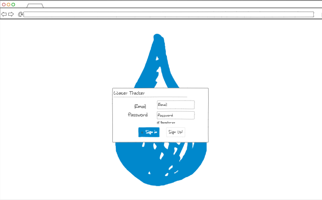
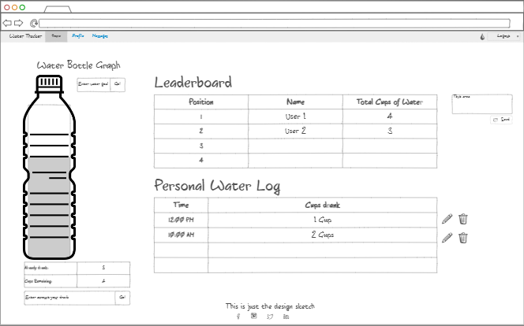

# Mindly Drinking App

## Design  
**Elevator Pitch** 
How many times have you tried to keep up with your hydration? Well, I lost my count. Today, drinking water is becoming more and more important. However, it is hard to keep track of how much water we drink. That is why we created Mindly Drinking. This app lets you track you water consumption every day. But should you do it alone? No! You will be able to do it with other people as well, and they will be able to send message to remind you to drink that cup of water you are missing. So, are you ready to help others keep themselves hydrated?

### Login Screen

### Main Screen

*Key features*
-	Secure login over HTTPS
-	Be able to set up a profile, so users can get to know each other a little bit
-	Ability to add/delete water consumption
-	Record data log
-	Display individual progress bar
-	Display real-time leaderboard to show people’s overall water consumption
-	Be able to send a message to the whole group, so people can be encouraged to drink more water
-	Be able to set-up a water consumption goal

