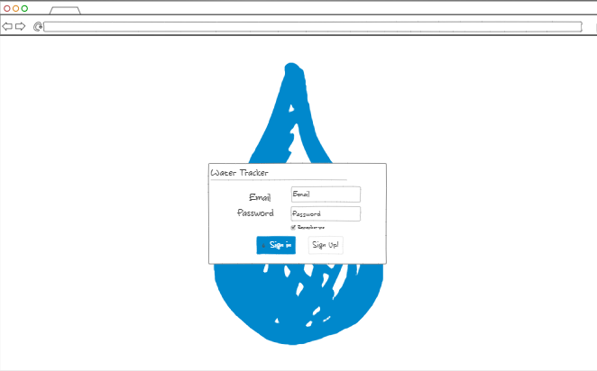
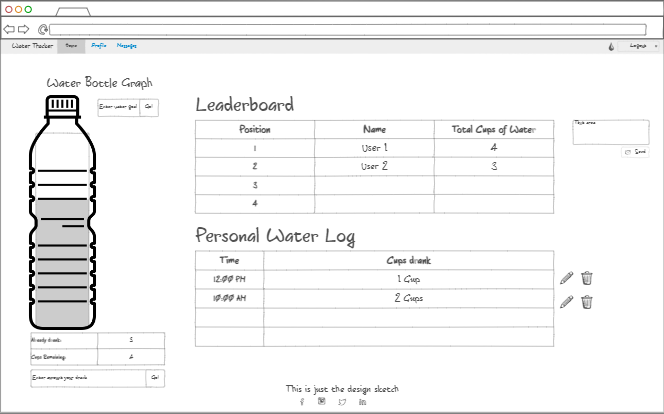

# Mindly Drinking App

## Design <br>
**Elevator Pitch**<br>
How many times have you tried to keep up with your hydration? Well, I lost my count. Today, drinking water is becoming more and more important. However, it is hard to keep track of how much water we drink. That is why we created Mindly Drinking. This app lets you track you water consumption every day. But should you do it alone? No! You will be able to do it with other people as well, and they will be able to send message to remind you to drink that cup of water you are missing. So, are you ready to help others keep themselves hydrated?

### Login Screen


### Main Screen


*Key features*
-	Secure login over HTTPS
-	Be able to set up a profile, so users can get to know each other a little bit
-	Ability to add/delete water consumption
-	Record data log
-	Display individual progress bar
-	Display real-time leaderboard to show people’s overall water consumption
-	Be able to send a message to the whole group, so people can be encouraged to drink more water
-	Be able to set-up a water consumption goal<br>

-----------------------------------------------------
## **What I have learned so far**

**3/28/2023** - I spent a lot of time trying to modify some information from the MongoDB entries, but I figured that I need to do the following to completely use MongoDB functionalities:
```javascript
  const response = await client.db('mindlyDrinking').collection('dailyLogs').updateOne(query, update);
```
This piece of code has the following *query* and *update*:
```javascript
  const query = { username: entry.username, date: entry.date };
    let update = { 
        $set: {}, 
        $inc: {},
    };
```
If I need to do this in the future, I can follow this instructions.

**3/25/2023** - After trying to find my bug, I found out that HTML form doesn't work correctly when implementing a DB. For some reason, the form doesn't wait until the promise in complete, so it exits and restarts again. Therefore, I changed that so there is no form any more. I will need to do something similar with the log in page.

**3/21/2023** - NOTE: Before deplying the new files to the server, delete the public folder, and edit the file so it doens't create a public folder in a public folder. Node.js won't be able to locate it and an error will appear.

**3/10/2023** - This was a long journey to do the JavaScript portion of this startup project. However, I would like to summarize what I have learned in this few bullet points:
* If I want to access an element and get is value, I can use the following code:
    ```javascript
      document.querySelector("#username").value;
    ```
where the # means that is an ID, and . is the class of the element. 
* In order to create a table, I will need to create elements, and then append them to each other:
    ```javascript
    const tableEl = document.querySelector("#drnkngLogTable"); //Find the table element
    const positionTdEl = document.createElement("td"); //creates a new column element
    positionTdEl.textContent = i + 1;//Add text to column element
    const rowEl = document.createElement('tr'); //creates row element
    const rowId = `row${i + 1}`; //Creates an ID for row element
    rowEl.setAttribute('id', rowId); // Assign id="" attibute to element
    rowEl.appendChild(positionTdEl); //Adds the column to the row element
    tableEl.appendChild(rowEl); //Adds row to table
    ```
* I was also having trouble when trying to insert buttons or costume figures. For example, when using the code `.setAttribute()`, all the attributes will be lowered case. So, in order to pass that, I did the following:
    ```javascript
    actionEl.innerHTML = '<button type="button" class="btn btn-danger"><svg xmlns="http://www.w3.org/2000/svg" width="16" height="16" fill="currentColor" class="bi bi-trash" viewBox="0 0 16 16"><path d="M5.5 5.5A.5.5 0 0 1 6 6v6a.5.5 0 0 1-1 0V6a.5.5 0 0 1 .5-.5zm2.5 0a.5.5 0 0 1 .5.5v6a.5.5 0 0 1-1 0V6a.5.5 0 0 1 .5-.5zm3 .5a.5.5 0 0 0-1 0v6a.5.5 0 0 0 1 0V6z"/><path fill-rule="evenodd" d="M14.5 3a1 1 0 0 1-1 1H13v9a2 2 0 0 1-2 2H5a2 2 0 0 1-2-2V4h-.5a1 1 0 0 1-1-1V2a1 1 0 0 1 1-1H6a1 1 0 0 1 1-1h2a1 1 0 0 1 1 1h3.5a1 1 0 0 1 1 1v1zM4.118 4 4 4.059V13a1 1 0 0 0 1 1h6a1 1 0 0 0 1-1V4.059L11.882 4H4.118zM2.5 3V2h11v1h-11z"/></svg></button>';
    ```
The `.innerHTML` allow me to insert HTML code and it will exactly put it in, without any problem. 

* Laslty, storing data in the localStorage was a little hard at first, but I was able to understand how it works. Here is the code I used:
    ```javascript
    JSON.parse(localStorage.getItem("localStorageID")); //This will grab the element stored in the data, and it will parse it. This is for arrays or objects. Otherwise, just .getItem should be okay

    localStorage.setItem('localStorageID', JSON.stringify(data)); //This will store objects in JSON, so they are easily accesible later.
    ```

**3/1/2023** - *onclick=f()* is an attribute to add to my HTML elements if I want somethig to occur when a person clicks on that element. In this case, I need to created a function
that will be called when they click it. For example, login().

**2/23/2023** - JavaScript has a different way of creating Objects and Classe. I won't put everything I learned since I think it will be better to see the website
for the instructions of this class.

Now, I was able to work on my project, and I finished the HTML and CSS. Although the program works, I would like to go back and see if I can organize the code even better. I have
learned how to use Bootstrap. Using this tool reduced the time to have to create every single element. Moreoever, I was able to understand how to divide the website in different
sections and division, that way I was able to lay it out correctly. Now, I need to start working on the JS portion.

**2/21/2023** - After practicing with JavaScript for the first time, many of the structure is similar to C++ with minor differences as follows:
```javascript
let a = x; //(1) This sets a variable, like 'int varName = val;'
cons f = 1; //(2) This is similar to 'const int varName = value;'
```
The previous code is to set the variables that can change (1), and constant variables (2).
Also, equality changed as well, instead of two equal signs, now we use three as follows:
```javascript
a == 1; //Can create errors
a === 1; //This equality will be evaluated true if a = 1;
a !== 1; //This equality will be evaluated false if a = 1;
```
Another interesting thing I have learned is the if/else abbreviation version:
```javascript
a === 1? console.log(1) : console.log('not 1'); //This means 'is a equal to 1? If so, then 1; otherwise 'not 1'
```
Finally, for loops work the same as C++ with the addition of *for of* and *for in*, which are used to traverse through property values in an array and object's property
names on the other. See the code below:
```javascript
const obj = { a: 1, b: 'fish' };
for (const name in obj) {
  console.log(name);
}
// OUTPUT: a
// OUTPUT: b

const arr = ['a', 'b'];
for (const val of arr) {
  console.log(val);
}
// OUTPUT: 'a'
// OUTPUT: 'b'
```


**2/20/2023** - Since I started working on this app, I have been making extensively use of the *Go Live* feature of VS Code. Moreover, I was able to organize the login page where I wanted to have it. I also was able to create some messages to see which pages I still need to develop. For example, when clicking "Sing Up" button, it will take you to the sign up sheet. It can be read that the sites in underconstruction, with a construction sign emoji (&#128679;). I can the code for the construction is '&' + '#128679' without space in between.
Moreover, I decided to create five different htmls. One with the login screen, another for the signup screen, leadeboard, main page, and about page. I am slowly making progress.
Remember that I need to check 'flex' under style to see how the website responds to different screens.

In order to allow Bootstrap in my code and also have some functionality when "flexing", include the following code:
```html
        <link 
            href="https://cdn.jsdelivr.net/npm/bootstrap@5.3.0-alpha1/dist/css/bootstrap.min.css" 
            rel="stylesheet" 
            integrity="sha384-GLhlTQ8iRABdZLl6O3oVMWSktQOp6b7In1Zl3/Jr59b6EGGoI1aFkw7cmDA6j6gD" 
            crossorigin="anonymous" />
        <script src="https://cdn.jsdelivr.net/npm/bootstrap@5.3.0-alpha1/dist/js/bootstrap.bundle.min.js"></script>
```

Also, if I don't know why a code is not working, try to edit it in bootstrap and see what I am missing.